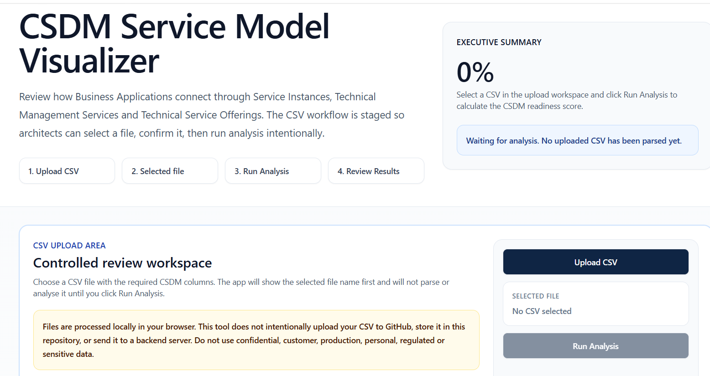
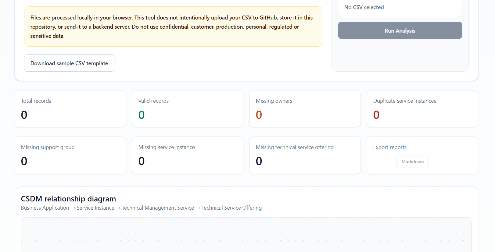
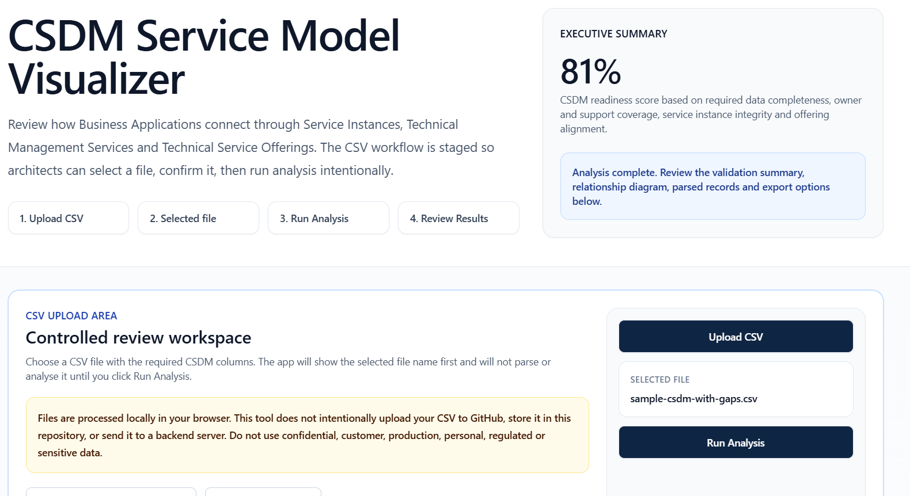
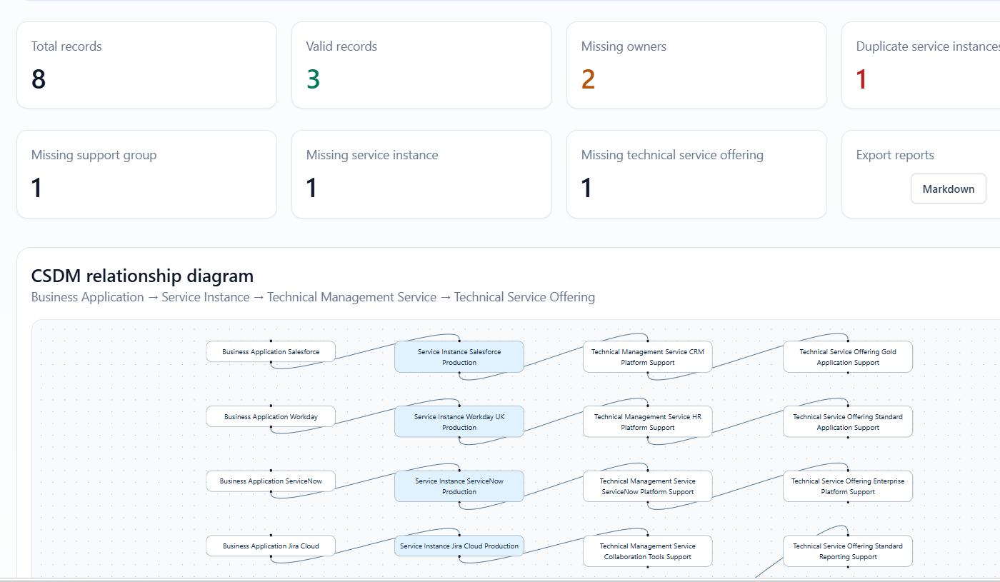
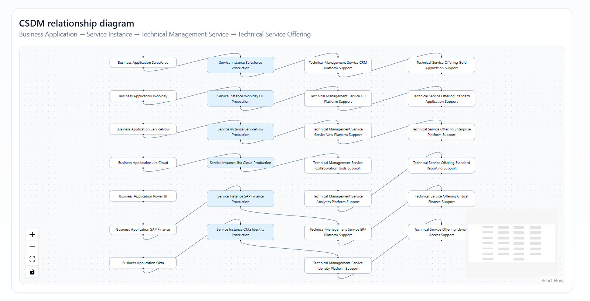
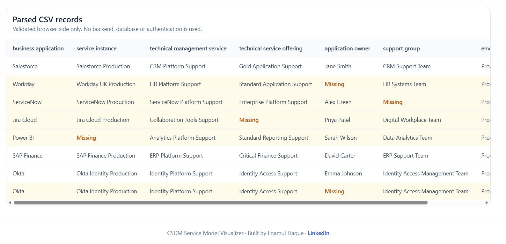

# CSDM Service Model Visualizer

A public browser based CSDM service model visualization and validation tool for ServiceNow architects, enterprise architects, platform owners, and governance teams.

The application helps users upload a CSDM aligned CSV file, confirm the selected file, run analysis intentionally, review readiness gaps, and visualize the relationship chain from Business Application to Service Instance to Technical Management Service to Technical Service Offering.

Live application

https://haquenam.github.io/csdm-service-model-visualizer/

Built by Enamul Haque

LinkedIn

https://www.linkedin.com/in/haquenam/

GitHub

https://github.com/haquenam

## Purpose

Many ServiceNow CSDM and CMDB initiatives begin with service mapping data in spreadsheets. Before that data is imported, governed, or operationalized, architects need a simple way to inspect whether the model is complete enough for review.

This tool provides a lightweight, public, browser based review workspace that allows users to upload a CSV file, confirm the selected file, run analysis intentionally, review CSDM readiness, identify data gaps, visualize relationships, inspect parsed records, and export a Markdown report.

## Current User Journey

The application follows a controlled review workflow.

| Step | Action                | Outcome                                                                              |
| ---- | --------------------- | ------------------------------------------------------------------------------------ |
| 1    | Upload CSV            | User selects a structured CSDM CSV file                                              |
| 2    | Confirm selected file | The selected file name is shown before analysis                                      |
| 3    | Run Analysis          | The CSV is parsed and validated in the browser                                       |
| 4    | Review results        | Readiness score, validation gaps, diagram, records, and export options are displayed |

This staged flow is intentional. It prevents the application from immediately parsing a file as soon as it is selected and gives users a more controlled architecture review experience.

## Data Privacy And Safety

Files are processed locally in the user’s browser.

This tool does not intentionally upload CSV files to GitHub, store them in this repository, or send them to a backend server.

Users should not upload confidential, customer, production, personal, regulated, or sensitive data.

The public version should be used with sample, synthetic, anonymized, or non sensitive data only.

## Important Disclaimer

This tool is for educational and architecture review purposes only.

It is not an official ServiceNow product. It is not affiliated with, endorsed by, or sponsored by ServiceNow.

It is not a replacement for formal CSDM design, CMDB governance, data protection review, ServiceNow import validation, security review, or production implementation assurance.

All outputs should be reviewed by qualified ServiceNow architects, enterprise architects, platform owners, or governance stakeholders before use in any formal delivery context.

## CSDM Relationship Model

The current version visualizes a simplified CSDM relationship chain.

```text
Business Application
        ↓
Service Instance
        ↓
Technical Management Service
        ↓
Technical Service Offering
```

This model is intended to help users understand how application and service data can be structured before it is reviewed, governed, or prepared for ServiceNow alignment.

## Required CSV Columns

The CSV file must contain these exact column names.

| Column Name                  | Description                                                               |
| ---------------------------- | ------------------------------------------------------------------------- |
| business_application         | The business application used or consumed by the organization             |
| service_instance             | The deployed or operational service instance                              |
| technical_management_service | The technical service responsible for managing or supporting the instance |
| technical_service_offering   | The specific technical service offering or support level                  |
| application_owner            | The named owner of the business application                               |
| support_group                | The group responsible for operational support                             |
| environment                  | The environment, such as Production, UAT, Test, or Development            |
| criticality                  | The business or operational criticality rating                            |

## Example CSV Structure

```csv
business_application,service_instance,technical_management_service,technical_service_offering,application_owner,support_group,environment,criticality
Salesforce,Salesforce Production,CRM Platform Support,Gold Application Support,Jane Smith,CRM Support Team,Production,High
Workday,Workday UK Production,HR Platform Support,Standard Application Support,John Brown,HR Systems Team,Production,High
ServiceNow,ServiceNow Production,ServiceNow Platform Support,Enterprise Platform Support,Alex Green,ServiceNow Platform Team,Production,High
```

## Validation Rules

The application currently checks for the following validation indicators.

| Validation Check                   | Description                                    |
| ---------------------------------- | ---------------------------------------------- |
| Total records                      | Total number of parsed CSV rows                |
| Valid records                      | Rows where all required fields are populated   |
| Missing owners                     | Records missing application owner              |
| Missing support group              | Records missing support group                  |
| Missing service instance           | Records missing service instance               |
| Missing technical service offering | Records missing technical service offering     |
| Duplicate service instances        | Repeated service instance names across records |

## Readiness Score

The CSDM readiness score is a lightweight indicator based on required data completeness, owner coverage, support group coverage, service instance integrity, and offering alignment.

The score is intended as a quick review signal, not a formal maturity assessment.

| Score Range | Interpretation                              |
| ----------- | ------------------------------------------- |
| 90 to 100   | Strong initial readiness                    |
| 70 to 89    | Usable but requires review and remediation  |
| 50 to 69    | Material data quality gaps exist            |
| Below 50    | Not ready for reliable service model review |


## Release Notes

### Release 1.2: CSV Template Guidance Pack

Release 1.2 adds CSV template guidance directly inside the upload workspace to improve onboarding before upload and analysis. Users can now review each required column, understand its purpose, compare example values, and follow enterprise data preparation notes before downloading the sample CSV template or selecting a file.

The guidance covers business application, service instance, technical management service, technical service offering, application owner, support group, environment, and criticality fields with required column descriptions and example values.

### Release 1.1: Validation Messaging And Severity Prioritisation

Release 1.1 improves validation clarity by adding a Priority Issues panel after analysis is complete. Detected validation gaps now include severity prioritisation for missing service instances, duplicate service instances, missing technical service offerings, missing support groups, and missing application owners. Each priority issue also includes a recommended action so reviewers can understand the next governance step before formal service model review.

## Screenshots

### Home And Workflow



### Controlled Upload Workspace



### Analysis Summary



### CSDM Relationship Diagram



### Parsed CSV Records



### Footer Branding



## Technology Stack

| Layer             | Technology                 |
| ----------------- | -------------------------- |
| Application type  | Static browser application |
| Language          | TypeScript and JavaScript  |
| UI runtime        | React                      |
| CSV parsing       | PapaParse                  |
| Diagram rendering | React Flow                 |
| Styling           | Tailwind CSS               |
| Hosting           | GitHub Pages               |
| CI and deployment | GitHub Actions             |

## Architecture

The application is intentionally simple.

```text
User Browser
    |
    | Select CSV file
    ↓
Browser Local Processing
    |
    | Confirm selected file
    | Parse CSV after Run Analysis
    | Validate required fields
    | Calculate readiness score
    | Generate relationship diagram
    ↓
Results Displayed In Browser
```

No backend server is required.

No database is required.

No authentication is required.

No ServiceNow instance connection is required.

## Local Setup

Clone the repository.

```bash
git clone https://github.com/haquenam/csdm-service-model-visualizer.git
```

Go into the project folder.

```bash
cd csdm-service-model-visualizer
```

Install dependencies.

```bash
npm install
```

Build the application.

```bash
npm run build
```

Preview locally.

```bash
npm run preview
```

## GitHub Pages Deployment

The app is deployed using GitHub Actions.

The repository includes a workflow file under the following path.

```text
.github/workflows/deploy-pages.yml
```

The deployment process is as follows.

| Step | Description                                                      |
| ---- | ---------------------------------------------------------------- |
| 1    | Code is merged into the main branch                              |
| 2    | GitHub Actions runs the build                                    |
| 3    | Static files are generated                                       |
| 4    | GitHub Pages publishes the site                                  |
| 5    | The application becomes available at the public GitHub Pages URL |

Live application

```text
https://haquenam.github.io/csdm-service-model-visualizer/
```

## Public Use Guidance

Use this tool for the following scenarios.

| Suitable Use            | Description                                                               |
| ----------------------- | ------------------------------------------------------------------------- |
| Learning                | Understanding a simplified CSDM relationship model                        |
| Demonstration           | Showing how CSV based service data can be visualized                      |
| Architecture review     | Reviewing model completeness before deeper design                         |
| Data quality discussion | Identifying common ownership and relationship gaps                        |
| Portfolio showcase      | Demonstrating practical ServiceNow and AI assisted development capability |

Do not use this tool for the following scenarios.

| Not Recommended                 | Reason                                                        |
| ------------------------------- | ------------------------------------------------------------- |
| Real customer data              | Public browser based tools should avoid sensitive information |
| Production CMDB import approval | This tool is not a formal import validator                    |
| Regulatory evidence             | It is not designed as an audit control                        |
| Final CSDM certification        | Formal review by qualified stakeholders is still required     |
| ServiceNow API integration      | Current version has no ServiceNow instance connection         |

## Repository Principles

This repository follows these principles.

| Principle        | Meaning                                                       |
| ---------------- | ------------------------------------------------------------- |
| Public safe      | No customer or confidential data is stored in the repository  |
| Browser first    | The tool runs fully in the browser                            |
| Simple by design | No backend or database dependency                             |
| Architecture led | The tool focuses on CSDM relationship clarity                 |
| Governance aware | The workflow includes explicit data safety warnings           |
| Reusable         | The app can be used for demos, learning, and portfolio review |

## Known Limitations

| Limitation                   | Explanation                                                     |
| ---------------------------- | --------------------------------------------------------------- |
| Simplified CSDM model        | The current version focuses on a four object relationship chain |
| No ServiceNow API            | The app does not connect to a ServiceNow instance               |
| No persistent storage        | Data is not saved after the browser session unless exported     |
| No authentication            | The public version is open access                               |
| No formal data certification | Results are advisory only                                       |
| Diagram scalability          | Very large CSV files may make the diagram difficult to read     |

## Roadmap

Potential future enhancements are listed below.

| Phase   | Enhancement                                                            |
| ------- | ---------------------------------------------------------------------- |
| Phase 1 | Improve validation messaging and gap prioritization                    |
| Phase 1 | Add severity levels for missing fields and duplicate service instances |
| Phase 1 | Add CSV template guidance inside the app                               |
| Phase 2 | Add export to JSON and CSV remediation format                          |
| Phase 2 | Add diagram export as PNG                                              |
| Phase 2 | Add filtering by environment and criticality                           |
| Phase 3 | Add support for multiple CSDM views                                    |
| Phase 3 | Add ServiceNow import preparation guidance                             |
| Phase 4 | Add optional AI assisted recommendations                               |
| Phase 4 | Add a ServiceNow scoped application version                            |

## Author

Built by Enamul Haque.

LinkedIn

https://www.linkedin.com/in/haquenam/

GitHub

https://github.com/haquenam

## License

This project is intended for public learning and demonstration use.

Review the repository license file before reusing, distributing, or modifying the project.
